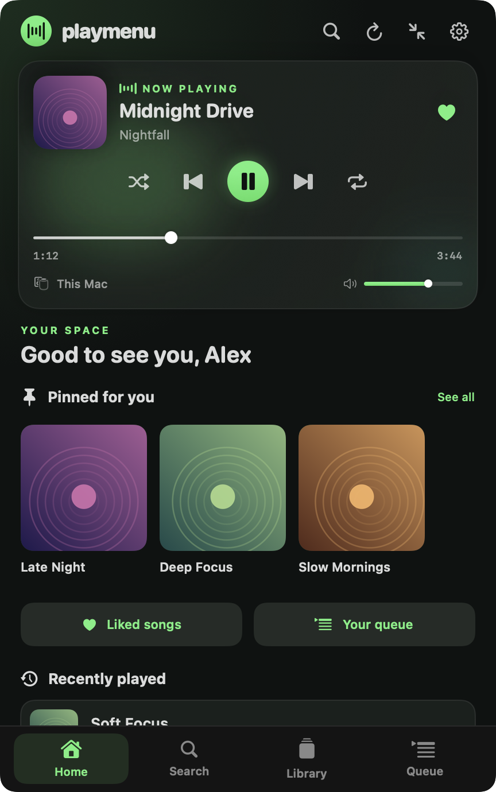
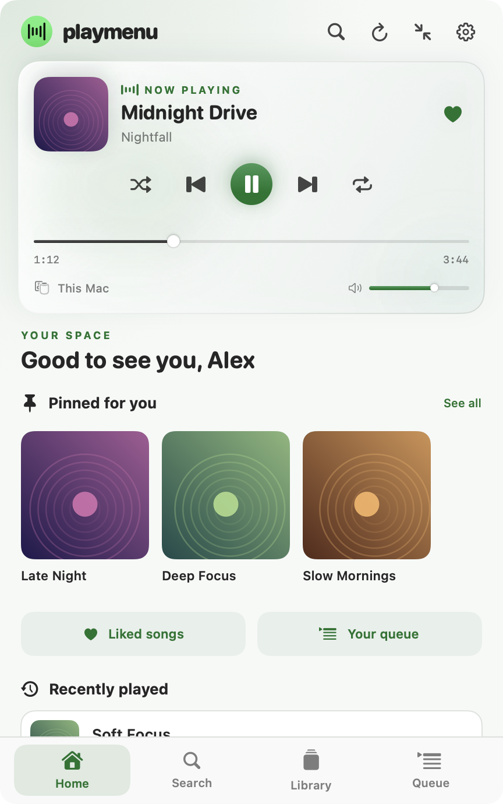
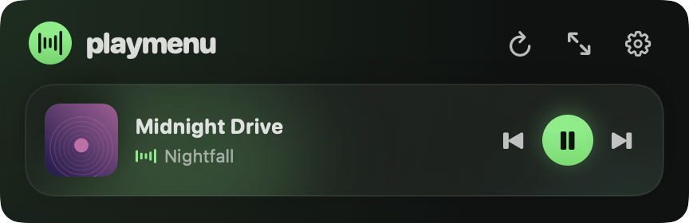
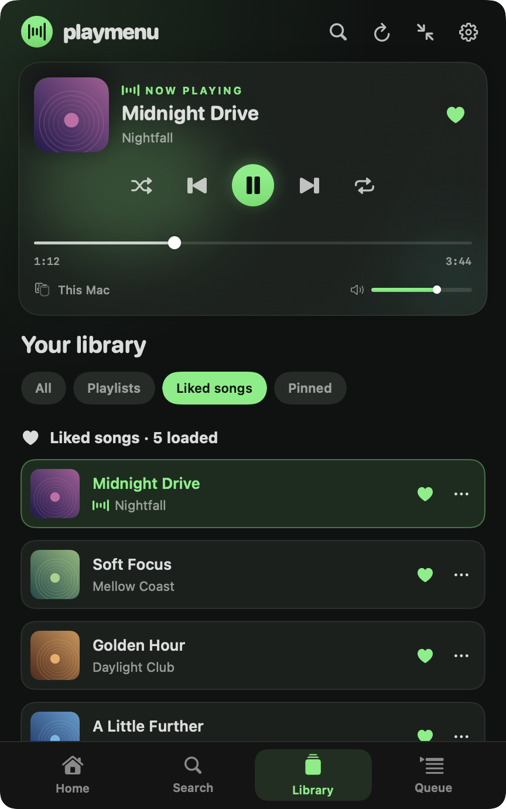
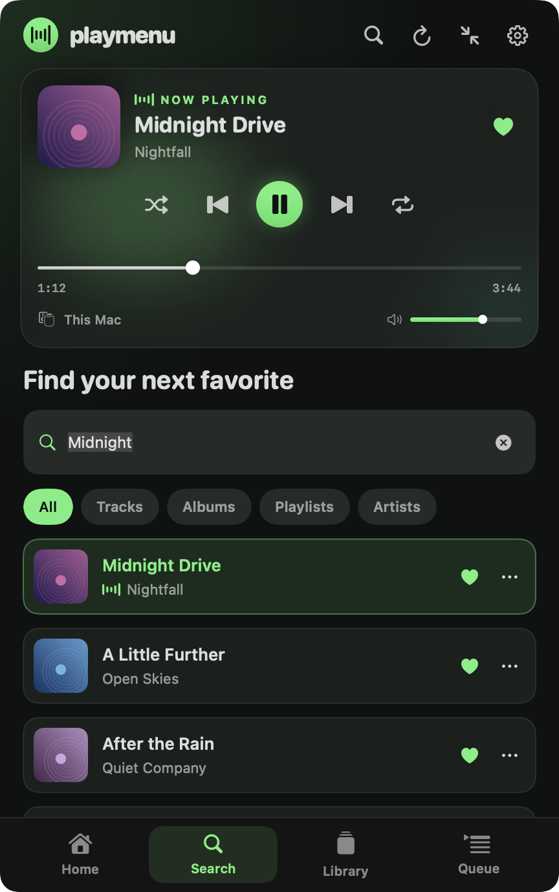
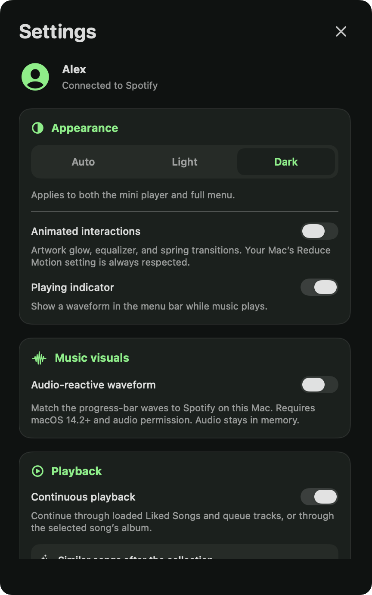
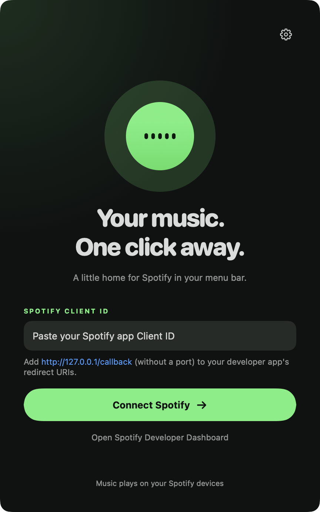

<p align="center">
  
</p>

<h1 align="center">PlayMenu for macOS</h1>

<p align="center">Your Spotify player, library, and search — one click from your menu bar.</p>

<p align="center">
  <a href="#get-playmenu"><strong>Get PlayMenu</strong></a>
  · <a href="Docs/SETUP.md">Connect Spotify</a>
  · <a href="Docs/CAPABILITY_MATRIX.md">Compatibility</a>
  · <a href="#build-from-source">Build from source</a>
</p>

<p align="center">
  <a href="screenshots/home-dark.png"></a>
  &nbsp;
  <a href="screenshots/home-light.png"></a>
</p>

<p align="center"><sub>Native SwiftUI views rendered from the app source with fictional account, music, and device data. Artwork is drawn locally for these previews. These images do not demonstrate a live Spotify session.</sub></p>

An independent, unofficial native Swift app for macOS. Browse and control music without leaving your current app. Playback updates automatically, including when the menu is closed; the refresh button is for library updates. Audio plays on your existing Spotify device. PlayMenu is not affiliated with or endorsed by Spotify.

## What you can do

| Keep music close | Find your next song | Make it yours |
| --- | --- | --- |
| Play/pause, skip, seek, adjust volume, shuffle, repeat, and choose a Spotify device. | Browse playlists, liked songs, recently played tracks, and your queue. Search for tracks, albums, artists, and playlists. | Switch between compact and full players, pin playlists, choose light/dark/automatic appearance, and use keyboard shortcuts. |

Soft, layered waves follow the song’s progress bar. Enable **Settings → Music visuals → Audio-reactive waveform** to match their height to Spotify audio on this Mac (macOS 14.2+ and audio permission). Audio stays in memory. With capture off or unavailable, the waves animate decoratively.

Save or remove liked songs with an Undo action. Cached library metadata stays available for browsing when offline. Spotify still needs a working connection and eligible account for remote playback. See the [feature guide](Docs/FEATURES.md) and [capability matrix](Docs/CAPABILITY_MATRIX.md) for details and validation limits.

<p align="center">
  <a href="screenshots/compact-dark.png"></a>
</p>

<p align="center"><sub>The compact player keeps the current song and transport controls close. Sample data.</sub></p>

<details>
<summary>More screenshots: Library, Search, Devices, Settings, and first launch</summary>

| Library | Search |
| --- | --- |
|  |  |

| Devices | Settings |
| --- | --- |
|  |  |



All previews use fictional sample data. See [screenshots/README.md](screenshots/README.md) for how to regenerate them.

</details>

## Get PlayMenu

Download **[PlayMenu v1.4.4](https://github.com/heyaaakash/playmenu/releases/tag/v1.4.4)** (build 13, replacing build 10):

| Apple Silicon | Intel | Verification |
| --- | --- | --- |
| [arm64 ZIP](https://github.com/heyaaakash/playmenu/releases/download/v1.4.4/PlayMenu-1.4.4-macos-arm64.zip) | [x86_64 ZIP](https://github.com/heyaaakash/playmenu/releases/download/v1.4.4/PlayMenu-1.4.4-macos-x86_64.zip) | [SHA-256 checksums](https://github.com/heyaaakash/playmenu/releases/download/v1.4.4/SHA256SUMS.txt) |

Unzip the package and move `PlayMenu.app` to Applications. Quit the previous SpotMenu copy before installing; the retained app identity preserves your existing sign-in and settings. Intel is cross-compiled; physical Intel use and clean installation remain unverified.

These packages are **ad-hoc signed and not notarized**. A signature check does not mean Apple has verified the app. A downloaded build may be blocked by Gatekeeper; [Apple explains how to open an app from an unidentified developer](https://support.apple.com/guide/mac-help/open-a-mac-app-from-an-unknown-developer-mh40616/mac). Only allow a download you trust.

## Requirements and compatibility

| Requirement | Current status |
| --- | --- |
| macOS | Deployment target is macOS 14+. Current version checked locally on macOS 27.0.1; minimum-version installation still needs testing. |
| Mac architecture | Apple Silicon checked locally; arm64 and x86_64 packages built locally. Intel is cross-compiled; physical Intel use is unverified. |
| Spotify account | An eligible account and a Spotify developer app Client ID are required. Playback controls require Premium. New development-mode apps also require the app owner to have Premium and restrict eligible users. |
| Playback | Start Spotify on a device first. PlayMenu controls that device; it does not stream audio itself. |
| Source builds | Swift 6 or later and a compatible macOS SDK/Xcode or command-line tools. |

Spotify’s development-mode rules restrict some playlist content. Sign-in, active-device behavior, Automation permission prompts, and real account playback must be checked separately from mocked tests. The [capability matrix](Docs/CAPABILITY_MATRIX.md) records those limits.

## Connect and use

1. Build and open PlayMenu, then click its music-note icon in the menu bar.
2. Create a Spotify developer app and register **`http://127.0.0.1/callback`** as its redirect URI (without a port).
3. Paste its **Client ID** into PlayMenu and choose **Connect Spotify**. Approve access in your browser.
4. Start music in Spotify on your Mac or another device, then use PlayMenu’s player.

Follow the [setup and troubleshooting guide](Docs/SETUP.md) for account prerequisites, requested scopes, errors, and device selection. No client secret is needed.

| Shortcut | Action |
| --- | --- |
| ⌘⇧Space | Open or close PlayMenu globally |
| ⌘K | Expand and focus Search |
| ⌘, | Open Settings |
| Space | Play/pause when not typing |
| ↑ / ↓, Return | Choose and activate a search result |
| Escape | Close an overlay, return from a collection, or dismiss the menu |

## Build from source

```sh
git clone https://github.com/heyaaakash/playmenu.git
cd spotify-mac-menu
./Scripts/test.sh
./Scripts/build-app.sh
open "dist/$(cat VERSION)/apps/$(uname -m)/PlayMenu.app"
```

Quit an older running copy before opening a rebuilt app. To install the local bundle, copy the bundle from `dist/<version>/apps/<architecture>/PlayMenu.app` into Applications. `./Scripts/package.sh` creates an architecture-specific ZIP and SHA-256 checksum in `dist/<version>/packages/`. `./Scripts/prepare-release.sh` runs local checks, refreshes screenshots, and prepares both architecture ZIPs and checksums in `dist/<version>/release/`. See the [output layout](Docs/DEVELOPMENT.md#generated-output-layout) for versioned app builds/packages/releases and the separate `dist/media/` and `dist/other/` areas. GitHub Actions is disabled; all verification and release preparation run on your Mac. See [development](Docs/DEVELOPMENT.md) and [release instructions](Docs/RELEASING.md).

## Privacy, help, and license

PlayMenu talks directly to Spotify for authorization, library data, and playback commands. It stores the refresh token in macOS Keychain and keeps preferences, search history, library metadata, and artwork caches locally. Disconnecting removes the token and library snapshot; preferences and artwork remain. There is no application-owned analytics or telemetry service in the current source. See [privacy and removal](Docs/PRIVACY.md).

Report bugs through [Issues](https://github.com/heyaaakash/playmenu/issues/new/choose), with the app version, macOS version, Mac architecture, and redacted reproduction steps. Check [SECURITY.md](SECURITY.md) before reporting a vulnerability. Contributions are described in [CONTRIBUTING.md](CONTRIBUTING.md).

The source is [MIT licensed](LICENSE). See [asset and dependency notes](Docs/ATTRIBUTIONS.md). Spotify names and marks belong to their respective owners.

Copyright © 2026 Aakash Rohilla.
